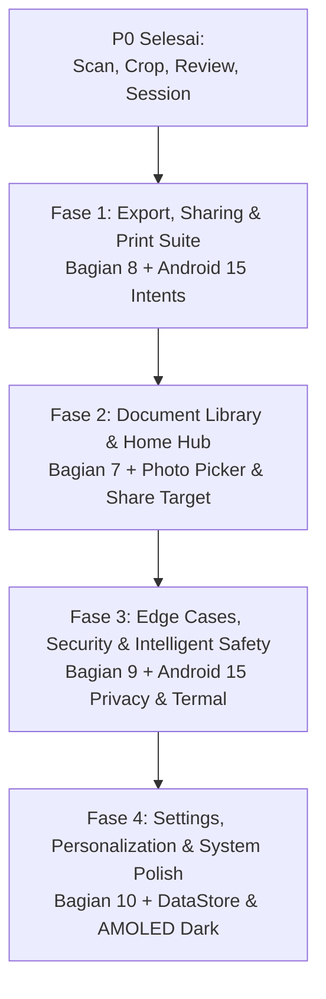

# 📋 YataGami — Comprehensive P1 Implementation Triage & Execution Roadmap

Dokumen ini merupakan master *triage* dan *roadmap* eksekusi komprehensif untuk seluruh fitur **P1 (Important — Significant UX Impact, High-Performance Native, Android 15 & HiOS 15 Integration)** pada **YataGami** untuk perangkat **Tecno Pova 7 4G (MediaTek Helio G100 Ultimate, 8GB RAM, 7000 mAh, Android 15 + HiOS 15)**.

> [!IMPORTANT]
> **Prinsip Triage Komprehensif:**
> Dokumen ini menyatukan dan menyintesis seluruh checklist teknis di `docs/`:
> 1. [YataGami_Development_Gap_Analysis.md](file:///home/will/Monorepo/YataGami/docs/YataGami_Development_Gap_Analysis.md) (Bagian 7, 8, 9, 10)
> 2. [YataGami_HelioG100_Android15_Advanced_Checklist.md](file:///home/will/Monorepo/YataGami/docs/YataGami_HelioG100_Android15_Advanced_Checklist.md) (Android 15 API 35, Helio G100)
> 3. [YataGami_TecnoPova7_Specific_Checklist.md](file:///home/will/Monorepo/YataGami/docs/YataGami_TecnoPova7_Specific_Checklist.md) (108MP binning, HiOS 15)
> 4. [YataGami_Image_Improvement_Checklist.md](file:///home/will/Monorepo/YataGami/docs/YataGami_Image_Improvement_Checklist.md) (Quality & Intelligence)
> 5. [YataGami_CPP_Optimization_Checklist.md](file:///home/will/Monorepo/YataGami/docs/YataGami_CPP_Optimization_Checklist.md) (CV High Performance)
> 6. [YataGami_CPP_GC_Cache_Deep_Checklist.md](file:///home/will/Monorepo/YataGami/docs/YataGami_CPP_GC_Cache_Deep_Checklist.md) (Native Memory & JNI)
>
> Seluruh item **akan dikerjakan 100%**. Triage ini menetapkan urutan bertahap dari alur ekspor $\rightarrow$ perpustakaan dokumen $\rightarrow$ proteksi cerdas $\rightarrow$ kustomisasi sistem.

---

## 🗺️ Roadmap Urutan Eksekusi P1

---

## 🥇 FASE 1: Export, Sharing & Print Suite (Bagian 8 + Android 15 Media)
> **Target:** Memberikan fleksibilitas ekspor penuh agar dokumen hasil pemindaian multi-halaman dapat dibagikan, dikompresi, dienkripsi, atau dicetak ke perangkat fisik.

### 📦 Deliverables & Detail Teknis:
1. [x] **Native Android Sharesheet Integration (Android 15 Compliant & ClipData Fixed)**
   - Ekspor instan ke WhatsApp, Telegram, Gmail, Google Drive, Bluetooth via `Intent.ACTION_SEND` (single file) & `Intent.ACTION_SEND_MULTIPLE` (multi-page/images).
   - Penggunaan `FileProvider` + `ClipData` multi-item eksplisit dengan flag ketat `FLAG_GRANT_READ_URI_PERMISSION`.
2. [x] **Selective / Partial Page Sharing**
   - Opsi membagikan atau menyimpan hanya halaman tertentu via multi-select visual thumbnail picker di `ExportModalBottomSheet`.
3. [x] **Export as Single Images (JPG & PNG Lossless)**
   - Pilihan format simpan per halaman:
     - JPEG Quality Selector: 80% (Ringan), 90% (Standar), 100% (Maksimal).
     - PNG Lossless (Ideal untuk dokumen teks tajam & arsip digital).
   - Penyimpanan teratur ke MediaStore `Pictures/YataGami/` dengan perlindungan `IS_PENDING`.
4. [ ] **Export as ZIP Archive**
   - Mengompres seluruh halaman gambar beresolusi penuh menjadi satu file `.zip` terstruktur dalam satu klik.
5. [ ] **Android Print Framework Integration**
   - Mendukung pencetakan langsung dari aplikasi ke printer WiFi / Bluetooth via custom `PrintDocumentAdapter` bawaan Android.
6. [x] **Tiered PDF Compression Selector**
   - **Minimum Size** (~100-200 KB/halaman, JPEG Q=65, 100 DPI)
   - **Standard (Rekomendasi)** (~300-500 KB/halaman, JPEG Q=85, 150 DPI)
   - **High Quality / Archive** (~1-2 MB/halaman, JPEG Q=95, 300 DPI)
7. [x] **PDF Metadata Intelligence & Filename Sanitization**
   - Template penamaan otomatis: `Scan_YYYYMMDD_HHMMSS_[DocType].pdf` (contoh: `Scan_20260820_143022_KTP.pdf`) dengan regex sanitization `[^a-zA-Z0-9_\-]`.
   - Penulisan metadata PDF resmi: `Title`, `Author` (YataGami), `Creator`, `CreationDate`, `Subject`, dan `Producer`.
8. [ ] **PDF Password Protection & Encryption (Opsional)**
   - Enkripsi PDF standar (Standard 128-bit / 256-bit AES) dengan dialog set password untuk dokumen privat (KTP, slip gaji, kontrak).

---

## 🥈 FASE 2: Document Library & Home Hub (Bagian 7 + Modern Integrations)
> **Target:** Membangun *Home Base* aplikasi untuk mengelola seluruh dokumen yang telah dipindai, menelusuri riwayat, mengimpor dokumen eksternal, dan menerima file dari aplikasi lain.

### 📦 Deliverables & Detail Teknis:
1. [x] **Modern Document Library UI (Jetpack Compose Edge-to-Edge)**
   - Tampilan daftar dokumen elegan (LazyColumn / Grid Switcher) dengan cover thumbnail, nama file, tanggal scan, jumlah halaman, dan ukuran file.
2. [x] **Disk-Backed Thumbnail Cache (200×200 px)**
   - Caching thumbnail ringan di `context.cacheDir/thumbnails/` dengan cache-busting timestamp `{docId}_{updatedAt}.jpg` dan LRU in-memory cache (<5ms).
3. [x] **Smart Date Grouping & Categorization Tags**
   - Pengelompokan cerdas berdasarkan waktu: *Hari Ini*, *Kemarin*, *Minggu Ini*, *Bulan Ini*, *Lebih Lama*.
   - Filter cepat berdasarkan tag tipe dokumen (*KTP*, *A4*, *F4*, *Struk*, *Foto*).
4. [x] **Instant Offline Prefix & Substring Search**
   - Kolom pencarian cepat berbasis nama dokumen atau tanggal secara 100% *offline* dengan debouncing 200ms reaktif.
5. [x] **Quick Action Context Menu & Bottom Sheet**
   - Menu aksi per kartu dokumen:
     - 📤 *Share* (Buka Android Sharesheet)
     - ✏️ *Rename* (Ubah nama file instan)
     - 📋 *Duplicate* (Duplikasi dokumen dengan progress state)
     - 🗑️ *Delete* (Soft delete dengan opsi Undo Snackbar & delayed physical purge)
6. [x] **Friendly Empty State & First-Scan CTA**
   - Desain ilustrasi modern saat perpustakaan kosong dengan tombol ajakan *"Mulai Pindai Dokumen"*.
7. [x] **Android 15 Photo Picker Integration (`PickVisualMedia`)**
   - Mengimpor foto dokumen dari Galeri tanpa memerlukan izin storage (`READ_MEDIA_IMAGES`), dibatasi aman hingga 20 foto, langsung masuk ke alur auto-crop YataGami.
8. [x] **Share Target Integration (`ACTION_SEND` receiver)**
   - Menerima share gambar atau PDF dari aplikasi lain (WhatsApp, File Manager, Telegram) langsung ke YataGami dengan `category.DEFAULT`, `launchMode="singleTask"`, dan penyalinan byte langsung ke cache.
9. [x] **Quick Re-Scan Flow**
   - Tombol FAB "Pindai" untuk langsung membuka viewfinder kamera dari Library Screen.

---

## 🥉 FASE 3: Edge Cases, Security & Intelligent Safety (Bagian 9 + Privacy)
> **Target:** Menjamin ketahanan dan kecerdasan aplikasi dalam kondisi pemindaian fisik yang menantang di dunia nyata serta melindungi privasi pengguna di Android 15.

### 📦 Deliverables & Detail Teknis:
1. **Specular Glare Detection & Suppression**
   - Deteksi kilau lampu pada permukaan glossy (KTP laminating, foto) via rasio piksel jenuh $\ge 248$ (`calculateGlareRatio`).
   - Tampilan visual warning *"Kilau cahaya terdeteksi, miringkan sedikit HP"* dan auto-kompresi highlight pada kanal L (Lab).
2. **Low-Light Assistant & Auto Torch (Lux < 50)**
   - Sensor cahaya mendeteksi lux $< 50$: otomatis menampilkan saran / menyalakan senter dual-LED Tecno Pova 7 serta mengaktifkan hardware Multi-Frame Noise Reduction (MFNR) Helio G100.
3. **Real-time Blur & Motion Guard (Laplacian Variance)**
   - Menahan auto-shutter jika skor varians Laplacian $< 85$ $\rightarrow$ Indikator *"Kamera goyang, stabilkan perangkat"*.
4. **Finger-in-Frame Detection Warning**
   - Analisis kontur sudut dokumen untuk mendeteksi oklusi jempol/jari saat memegang kertas $\rightarrow$ Notifikasi *"Jari terdeteksi di tepi dokumen"*.
5. **Multiple Document Detection Heuristic**
   - Jika terdapat $\ge 2$ kontur dokumen besar di dalam frame kamera, algoritma memprioritaskan kontur dokumen yang paling dominan/tengah.
6. **Blank Page Detection**
   - Mendeteksi halaman kosong (>95% putih/polos tanpa teks) sebelum diekspor ke PDF dan memberikan konfirmasi ke pengguna.
7. **Processing Failure & Singular Matrix Fallback**
   - Fallback otomatis ke *axis-aligned bounding box crop* jika transformasi homografi perspektif menghasilkan matriks singular.
8. **Storage Full Protection Guard (<500MB)**
   - Pemeriksaan kapasitas disk: jika sisa memori internal $< 500\text{MB}$, tampilkan dialog peringatan dan jeda auto-capture untuk mencegah file PDF korup.
9. **Helio G100 Thermal Throttling Adaptive Banner**
   - `DevicePerformanceMonitor` mendeteksi status termal `SEVERE` ($> 45^\circ\text{C}$): otomatis menurunkan pemrosesan ke *Tier 1 Fast* dan menampilkan badge *"Mode Hemat Termal Aktif"*.
10. **Screen Recording Detection & Privacy Guard (Android 15)**
    - Mendeteksi jika `MediaProjection` (screen recorder) sedang aktif saat pengguna memindai dokumen sensitif (KTP/identitas) dan menampilkan peringatan privasi.

---

## 🏅 FASE 4: Settings, Personalization & System Polish (Bagian 10)
> **Target:** Memberikan kendali penuh dan personalisasi mendalam bagi pengguna untuk mengoptimalkan pengalaman penggunaan sehari-hari.

### 📦 Deliverables & Detail Teknis:
1. **Preferences DataStore Architecture**
   - Penyimpanan pengaturan preferensi pengguna secara asinkron, reaktif (Kotlin Flow), dan *type-safe*.
2. **Default Document Preset & Enhancement Tier**
   - Pengaturan preset awal saat kamera dibuka (Auto / A4 / KTP / F4 / Struk) dan default tier filter (Tier 1 Fast / Tier 2 Standard).
3. **Custom Filename Template Engine**
   - Generator nama file fleksibel dengan variabel:
     - `{TYPE}_{DATE}_{TIME}`
     - `KTP_{NAME}_{DATE}`
     - `INV_{VENDOR}_{MONTH}`
4. **Shutter Sound & Haptic Feedback Customization**
   - Toggle suara shutter kamera dan pengaturan intensitas haptic vibration pada Tecno Pova 7.
5. **Default Storage Directory & Gallery Sync**
   - Pengaturan folder tujuan ekspor default (`/Documents/YataGami/`) dan toggle auto-save JPG ke Galeri.
6. **AMOLED Pure Dark Theme (`#000000`)**
   - Tema hitam pekat (*true black*) yang memanfaatkan efisiensi baterai 7000 mAh Tecno Pova 7.
7. **Storage Auto-Cleanup Policy**
   - Kebijakan retensi file capture mentah:
     - *Hapus Segera* (Setelah PDF tersimpan)
     - *Simpan 7 Hari* (Default aman)
     - *Simpan Selamanya*
8. **PDF Max Pages Guard (>50 Halaman)**
   - Peringatan ramah saat menyusun dokumen $> 50$ halaman agar file tidak terlalu besar untuk dikirim via email/chat.
9. **Android 15 System Polish (Predictive Back & Insets)**
   - Dukungan *Predictive Back Gesture Animation* antar layar.
   - Enforce *Edge-to-Edge Display* dengan penanganan `WindowInsets` yang sempurna (system bar tidak menutupi kontrol shutter).

---

## 📊 Matriks Ringkasan Eksekusi Komprehensif

| Fase | Modul | Fokus Utama | Total Deliverables Utama |
|:---:|---|---|---|
| **🥇 1** | **Export, Sharing & Print** | Ekspor Multi-format, Print, & Sharing | 8 Fitur (Sharesheet, Selective Share, JPG/PNG, ZIP, Print, PDF Tier, Metadata, Password) |
| **🥈 2** | **Document Library Hub** | Manajemen File, Search, & Integrasi | 9 Fitur (LazyColumn UI, Disk Cache 200x200, Date Grouping, Search, Context Menu, Photo Picker, Share Target) |
| **🥉 3** | **Edge Cases & Safety** | Ketahanan Fisik, Termal, & Privasi | 10 Fitur (Glare, Low-Light Torch, Blur Guard, Finger Warning, Blank Page, Fallback, Storage Guard, Thermal, Screen Record) |
| **🏅 4** | **Settings & Polish** | Preferensi, DataStore, & Sistem | 9 Fitur (DataStore, Presets, Template Engine, Haptic/Sound, AMOLED Dark, Auto-cleanup, Predictive Back) |

---

## 🔗 Rujukan Dokumen Checklist Teknis Terkait

1. 📄 **[YataGami_Development_Gap_Analysis.md](file:///home/will/Monorepo/YataGami/docs/YataGami_Development_Gap_Analysis.md)** — Master gap analysis seluruh tahapan proyek (P0, P1, P2).
2. ⚡ **[YataGami_CPP_GC_Cache_Deep_Checklist.md](file:///home/will/Monorepo/YataGami/docs/YataGami_CPP_GC_Cache_Deep_Checklist.md)** — Zero-Copy memory, BufferPool C++, dan cache efficiency.
3. 🏎️ **[YataGami_CPP_Optimization_Checklist.md](file:///home/will/Monorepo/YataGami/docs/YataGami_CPP_Optimization_Checklist.md)** — Optimasi OpenCV native, pipeline decoupling, dan Lab color channel isolation.
4. 📱 **[YataGami_HelioG100_Android15_Advanced_Checklist.md](file:///home/will/Monorepo/YataGami/docs/YataGami_HelioG100_Android15_Advanced_Checklist.md)** — Optimasi MediaTek Helio G100 Ultimate, 2x Cortex-A76 affinity, dan Camera2 ISP hardware.
5. 🖼️ **[YataGami_Image_Improvement_Checklist.md](file:///home/will/Monorepo/YataGami/docs/YataGami_Image_Improvement_Checklist.md)** — Algoritma preprocessing, text deskewing, dan 150 DPI document presets.
6. 🔋 **[YataGami_TecnoPova7_Specific_Checklist.md](file:///home/will/Monorepo/YataGami/docs/YataGami_TecnoPova7_Specific_Checklist.md)** — Karakteristik hardware Tecno Pova 7 4G (108MP sensor binning, 7000 mAh, HiOS 15 background killer).
